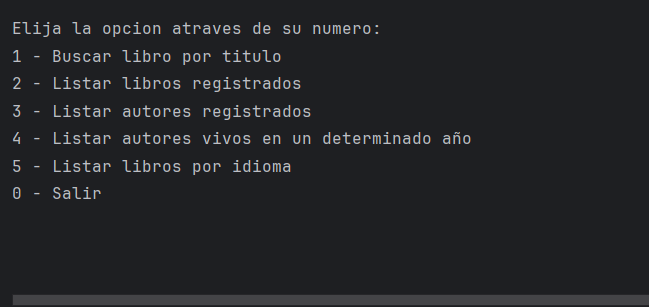

Inicio del proyecto:
En consola se creara un catálogo de libros donde los usuarios pueden registrar libros en una base de datos y obtener información sobre ellos.

Puntos clave:

Tecnologías: Java, Spring y Postgres.

Menu:

Funciones:
Buscar libro por título en la API Gutendex y registrarlo en la base de datos.

Listar libros registrados en la base de datos.

Listar autores registrados.

Listar autores vivos en un año específico.

Listar libros por idioma.

Manejo de errores:
Mostrar un mensaje si el libro no se encuentra en la API.

Evitar insertar el mismo libro dos veces en la base de datos.
